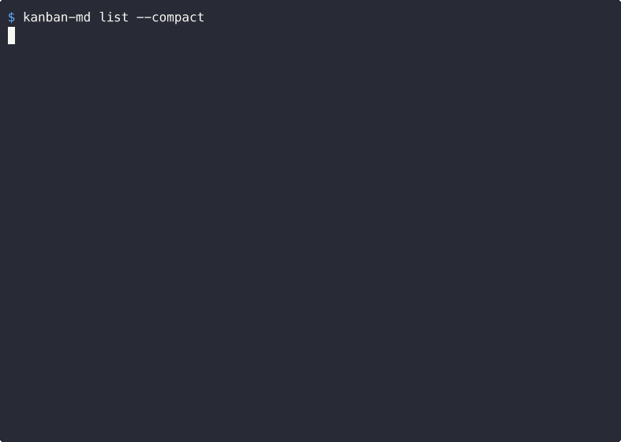
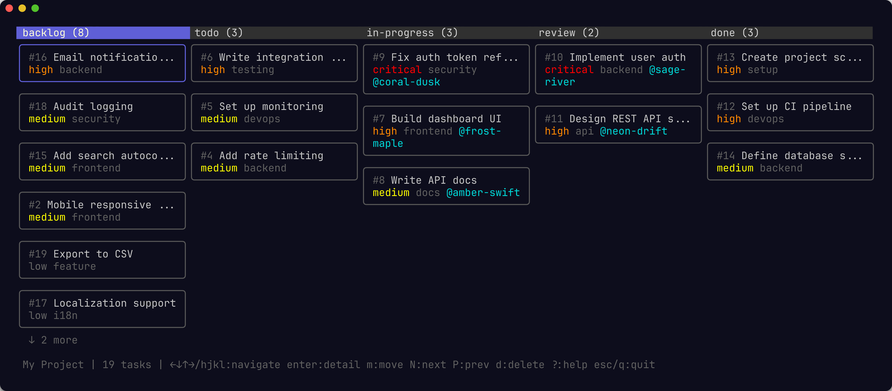

# kanban-md

[](https://github.com/antopolskiy/kanban-md/actions/workflows/build.yml)
[](https://github.com/antopolskiy/kanban-md/actions/workflows/release.yml)
[](https://go.dev/)
[](https://github.com/antopolskiy/kanban-md/releases/latest)
[](https://codecov.io/gh/antopolskiy/kanban-md)
[](LICENSE)

An agents-first file-based Kanban. Built for multi-agent workflows to allow AI agents work in parallel without clashing. Ultra-fast single binary CLI. Agent skills included. Lean and future-proof: no database, no server, no SaaS — just files.



## Why kanban-md?

Project management tools are designed for humans clicking buttons. kanban-md is designed for AI agents running commands and human supervision.

- **Agents-first.** Token-efficient output formats (`--compact`), atomic claim-and-move operations (`pick --claim`), and installable agent skills that teach agents how to use the board — out of the box.
- **Multi-agent safe.** Claims provide cooperative locking so multiple agents can work the same board without stepping on each other. Claims expire automatically, and the `pick` command atomically finds, claims, and moves the next available task.
- **Plain files.** Every task is a Markdown file. Agents, humans, scripts, and `grep` all work equally well. No API tokens, no authentication, no rate limits.
- **Zero dependencies at runtime.** A single static binary. No database, no server, no config service.
- **Skills included.** Pre-written skills for using the CLI tool and a multi-agent development workflow. Installable via `kanban-md skill install`.
- **TUI for observation.** A full interactive terminal board with keyboard navigation. It auto-refreshes when task files change on disk.



## Installation

### Homebrew (macOS/Linux)

```bash
# CLI + 
brew install antopolskiy/tap/kanban-md antopolskiy/tap/kanban-md-tui
```

### Go

```bash
go install github.com/antopolskiy/kanban-md/cmd/kanban-md@latest
go install github.com/antopolskiy/kanban-md/cmd/kanban-md-tui@latest
```

Homebrew also installs `kbmd` as a shorthand alias for `kanban-md`.

### Binary downloads

Pre-built binaries for macOS, Linux, and Windows are available on the [Releases](https://github.com/antopolskiy/kanban-md/releases/latest) page.

## Quick start

Note: normally, you wouldn't run the CLI commands directly. Your agents will do that for you.

```bash
# Initialize a board in the current directory
kanban-md init --name "My Project"

# Create some tasks
kanban-md create "Set up CI pipeline" --priority high --tags devops
kanban-md create "Write API docs" --assignee alice --due 2026-03-01
kanban-md create "Fix login bug" --status todo --priority critical

# List all tasks
kanban-md list

# Filter and sort
kanban-md list --status todo,in-progress --sort priority --reverse

# Move a task forward
kanban-md move 3 in-progress
kanban-md move 3 --next

# Edit a task
kanban-md edit 2 --add-tag documentation --body "Cover all REST endpoints"

# View task details
kanban-md show 1

# Done with a task
kanban-md move 1 done

# Or delete it
kanban-md delete 3 --force
```

## How it works

Running `kanban-md init` creates a `kanban/` directory:

```
kanban/
  config.yml
  tasks/
    001-set-up-ci-pipeline.md
    002-write-api-docs.md
    003-fix-login-bug.md
```

Each task file is standard Markdown with YAML frontmatter:

```markdown
---
id: 1
title: Set up CI pipeline
status: backlog
priority: high
created: 2026-02-07T10:30:00Z
updated: 2026-02-07T10:30:00Z
tags:
  - devops
---

Optional body with more detail, context, or notes.
```

The `config.yml` tracks board settings:

```yaml
version: 3
board:
  name: My Project
tasks_dir: tasks
statuses:
  - backlog
  - todo
  - in-progress
  - review
  - done
priorities:
  - low
  - medium
  - high
  - critical
wip_limits:
  in-progress: 3
  review: 2
classes:
  - name: expedite
    wip_limit: 1
    bypass_column_wip: true
  - name: fixed-date
  - name: standard
  - name: intangible
claim_timeout: 1h
defaults:
  status: backlog
  priority: medium
  class: standard
next_id: 4
```

## Commands

### `init`

Create a new kanban board.

```bash
kanban-md init [--name NAME] [--statuses s1,s2,s3] [--wip-limit status:N]
```

| Flag | Description |
|------|-------------|
| `--name` | Board name (defaults to parent directory name) |
| `--statuses` | Comma-separated status list (default: backlog,todo,in-progress,review,done) |
| `--wip-limit` | WIP limit per status (format: `status:N`, repeatable) |

### `create`

Create a new task. Aliases: `add`.

```bash
kanban-md create TITLE [FLAGS]
```

| Flag | Default | Description |
|------|---------|-------------|
| `--status` | backlog | Initial status |
| `--priority` | medium | Priority level |
| `--assignee` | | Person assigned |
| `--tags` | | Comma-separated tags |
| `--due` | | Due date (YYYY-MM-DD) |
| `--estimate` | | Time estimate (e.g. 4h, 2d) |
| `--class` | standard | Class of service (expedite, fixed-date, standard, intangible) |
| `--parent` | | Parent task ID |
| `--depends-on` | | Dependency task IDs (comma-separated) |
| `--body` | | Task description |

### `list`

List tasks with filtering and sorting. Aliases: `ls`.

```bash
kanban-md list [FLAGS]
```

| Flag | Default | Description |
|------|---------|-------------|
| `--status` | | Filter by status (comma-separated) |
| `--priority` | | Filter by priority (comma-separated) |
| `--assignee` | | Filter by assignee |
| `--tag` | | Filter by tag |
| `-s`, `--search` | | Search tasks by title, body, or tags (case-insensitive) |
| `--blocked` | false | Show only blocked tasks |
| `--not-blocked` | false | Show only non-blocked tasks |
| `--parent` | | Filter by parent task ID |
| `--unblocked` | false | Show only tasks with all dependencies satisfied |
| `--unclaimed` | false | Show only unclaimed or expired-claim tasks |
| `--claimed-by` | | Filter by claimant name |
| `--class` | | Filter by class of service |
| `--group-by` | | Group results by field (assignee, tag, class, priority, status) |
| `--sort` | id | Sort by: id, status, priority, created, updated, due |
| `-r`, `--reverse` | false | Reverse sort order |
| `-n`, `--limit` | 0 | Max results (0 = unlimited) |

### `show`

Show full details of a task.

```bash
kanban-md show ID
```

### `edit`

Modify an existing task.

```bash
kanban-md edit ID [FLAGS]
kanban-md edit 1,2,3 --priority high  # batch edit
```

| Flag | Description |
|------|-------------|
| `--title` | New title (renames the file) |
| `--status` | New status |
| `--priority` | New priority |
| `--assignee` | New assignee |
| `--add-tag` | Add tags (comma-separated) |
| `--remove-tag` | Remove tags (comma-separated) |
| `--due` | New due date (YYYY-MM-DD) |
| `--clear-due` | Remove due date |
| `--estimate` | New time estimate |
| `--body` | New body text |
| `--started` | Set started date (YYYY-MM-DD) |
| `--clear-started` | Clear started timestamp |
| `--completed` | Set completed date (YYYY-MM-DD) |
| `--clear-completed` | Clear completed timestamp |
| `--parent` | Set parent task ID |
| `--clear-parent` | Clear parent |
| `--add-dep` | Add dependency task IDs (comma-separated) |
| `--remove-dep` | Remove dependency task IDs (comma-separated) |
| `--block` | Mark task as blocked with reason |
| `--unblock` | Clear blocked state |
| `--claim` | Claim task for an agent (set claimed_by) |
| `--release` | Release claim on task |
| `--class` | Set class of service |
| `-f`, `--force` | Override WIP limits and claims |

### `move`

Change a task's status.

```bash
kanban-md move ID [STATUS]
kanban-md move ID --next
kanban-md move ID --prev
kanban-md move 1,2,3 todo          # batch move
```

| Flag | Description |
|------|-------------|
| `--next` | Advance to next status in the configured order |
| `--prev` | Move back to previous status |
| `--claim` | Claim task for an agent |
| `--force` | Override WIP limits and claims |

### `delete`

Delete a task. Aliases: `rm`.

```bash
kanban-md delete ID [--force]
kanban-md delete 1,2,3 --force     # batch delete
```

Prompts for confirmation in interactive terminals. Use `--force` to skip the prompt (required in non-interactive contexts like scripts). Batch delete always requires `--force`.

### `board`

Show a board summary with task counts per status, WIP utilization, blocked/overdue counts, and priority distribution. Aliases: `summary`.

```bash
kanban-md board
kanban-md board --watch    # live-update on file changes
```

| Flag | Default | Description |
|------|---------|-------------|
| `-w`, `--watch` | false | Live-update the board on file changes (Ctrl+C to stop) |
| `--group-by` | | Group by field (assignee, tag, class, priority, status) |

### `pick`

Atomically find and claim the next available task. Designed for multi-agent workflows where agents need exclusive task assignment.

```bash
kanban-md pick --claim agent-1
kanban-md pick --claim agent-1 --status todo --move in-progress
kanban-md pick --claim agent-1 --tag backend
```

| Flag | Default | Description |
|------|---------|-------------|
| `--claim` | (required) | Agent name to claim the task for |
| `--status` | all non-terminal | Source status(es) to pick from (comma-separated) |
| `--move` | | Also move picked task to this status |
| `--tag` | | Only pick tasks with this tag |

The pick algorithm selects from unclaimed, unblocked tasks with satisfied dependencies, prioritizing by class of service (expedite > fixed-date > standard > intangible), then by priority within each class. Fixed-date tasks are further sorted by earliest due date.

### `metrics`

Show flow metrics: throughput, average lead/cycle time, flow efficiency, and aging work items.

```bash
kanban-md metrics [--since YYYY-MM-DD]
```

| Flag | Default | Description |
|------|---------|-------------|
| `--since` | | Only include tasks completed after this date |

### `log`

Show the activity log of board mutations (create, move, edit, delete, block, unblock).

```bash
kanban-md log [FLAGS]
```

| Flag | Default | Description |
|------|---------|-------------|
| `--since` | | Show entries after this date (YYYY-MM-DD) |
| `--limit` | 0 | Maximum number of entries (most recent) |
| `--action` | | Filter by action type (create, move, edit, delete, block, unblock) |
| `--task` | | Filter by task ID |

### `config`

View or modify board configuration.

```bash
kanban-md config                       # show all config values
kanban-md config get KEY               # get a single value
kanban-md config set KEY VALUE         # set a writable value
```

Available keys:

| Key | Writable | Description |
|-----|----------|-------------|
| `board.name` | yes | Board name |
| `board.description` | yes | Board description |
| `defaults.status` | yes | Default status for new tasks |
| `defaults.priority` | yes | Default priority for new tasks |
| `statuses` | no | List of statuses |
| `priorities` | no | List of priorities |
| `tasks_dir` | no | Tasks directory name |
| `wip_limits` | no | WIP limits per status |
| `next_id` | no | Next task ID |
| `version` | no | Config schema version |

### `context`

Generate a markdown summary of the board state for embedding in context files (e.g. `CLAUDE.md`, `AGENTS.md`).

```bash
kanban-md context                             # print to stdout
kanban-md context --write-to AGENTS.md        # write/update in file
kanban-md context --sections blocked,overdue  # limit sections
kanban-md context --days 14                   # recently completed lookback
```

| Flag | Default | Description |
|------|---------|-------------|
| `--write-to` | | Write context to file (creates or updates in-place) |
| `--sections` | all | Comma-separated section filter |
| `--days` | 7 | Recently completed lookback in days |

When using `--write-to`, the context block is wrapped in HTML comment markers (`<!-- BEGIN kanban-md context -->` / `<!-- END kanban-md context -->`). If the file already contains these markers, only the block between them is replaced — all other content is preserved.

## Interactive TUI

`kanban-md-tui` provides a full interactive terminal board with keyboard navigation. It auto-refreshes when task files change on disk.

```bash
kanban-md-tui             # launch from any directory with a kanban/ board
kanban-md-tui --dir PATH  # point to a specific kanban directory
```

### Keyboard shortcuts

| Key | Action |
|-----|--------|
| `h` / `l` | Move between columns |
| `j` / `k` | Move between tasks within a column |
| `Enter` | View task details |
| `m` | Move task to a different status (picker dialog) |
| `M` | Move task to next status |
| `d` | Delete task (with confirmation) |
| `r` | Refresh board |
| `?` | Show help |
| `q` / `Ctrl+C` | Quit |

## Global flags

These work with any command:

| Flag | Description |
|------|-------------|
| `--json` | Force JSON output |
| `--table` | Force table output (default) |
| `--compact` / `--oneline` | Compact one-line-per-record output |
| `--dir` | Path to kanban directory (overrides auto-detection) |
| `--no-color` | Disable color output (also respects `NO_COLOR` env var) |

### Output format

The default output format is **table** (human-readable). Use flags to switch:

```bash
# Default: table
kanban-md list --status todo

# Compact: one line per task, ideal for AI agents
kanban-md list --compact

# JSON: for scripting and piping
kanban-md list --json | jq '.[].title'
```

Set the `KANBAN_OUTPUT` environment variable to change the default: `json`, `table`, `compact`, or `oneline`.

Override priority: `--json`/`--table`/`--compact` flags > `KANBAN_OUTPUT` env var > table default.

## Configuration

kanban-md discovers its config by walking upward from the current directory, similar to how `git` finds `.git/`. This means you can run commands from any subdirectory in your project.

Use `--dir` to point to a specific board:

```bash
kanban-md --dir /path/to/kanban list
```

### Custom statuses

Define your own workflow columns:

```bash
kanban-md init --statuses "open,in-progress,blocked,closed"
```

The order matters — it defines the progression for `move --next` and `move --prev`, and the sort order for `list --sort status`.

### Custom priorities

Edit `config.yml` directly to customize priorities:

```yaml
priorities:
  - trivial
  - normal
  - urgent
  - showstopper
defaults:
  priority: normal
```

## Shell completions

Generate completions for your shell:

```bash
# bash
source <(kanban-md completion bash)

# zsh
kanban-md completion zsh > "${fpath[1]}/_kanban-md"

# fish
kanban-md completion fish | source

# PowerShell
kanban-md completion powershell | Out-String | Invoke-Expression
```

## Agent skills

kanban-md ships with installable skills that teach AI agents how to use the board. Skills are auto-triggered prompt files that give agents command references, decision trees, and workflows — so they manage tasks correctly without you writing custom instructions.

Two skills are included:

| Skill | Description |
|-------|-------------|
| **kanban-md** | Command reference, decision trees, and workflows for managing tasks via CLI. Auto-triggered when an agent encounters task-related work. |
| **kanban-based-development** | Full autonomous development workflow — multi-agent claim semantics, git worktrees for isolation, and a strict status lifecycle (in-progress → review → done). |

```bash
# Install skills for all detected agents (Claude Code, Codex, Cursor, OpenClaw)
kanban-md skill install

# Check if installed skills are up to date
kanban-md skill check

# Update skills to match current CLI version
kanban-md skill update

# Preview skill contents
kanban-md skill show
```

Skills are versioned to match the CLI. When you upgrade kanban-md, `skill check` tells you if your installed skills are outdated, and `skill update` brings them in sync.

## Multi-agent workflow

kanban-md is designed for concurrent work by multiple agents (AI or human) through claims and classes of service.

### Claims

Claims provide cooperative locking — an agent claims a task before working on it, preventing other agents from picking the same task. Claims expire after the configured timeout (default: 1 hour).

```bash
# Agent picks next available task
kanban-md pick --claim agent-1 --move in-progress

# Agent finishes and releases
kanban-md edit 5 --release
kanban-md move 5 done

# Another agent picks from a specific queue
kanban-md pick --claim agent-2 --status todo --tag backend
```

### Classes of service

Tasks can have a class of service that affects WIP limits and pick priority:

| Class | Behavior |
|-------|----------|
| **expedite** | Bypasses column WIP limits. Has its own board-wide WIP limit (default: 1). Picked first. |
| **fixed-date** | Picked by earliest due date within its priority tier. |
| **standard** | Default class. Normal WIP and priority rules. |
| **intangible** | Picked last. For background/maintenance work. |

```bash
kanban-md create "Critical hotfix" --class expedite --priority critical
kanban-md create "Q2 deadline feature" --class fixed-date --due 2026-06-30
```

### Swimlanes

Group board or list views by any field to see work distribution:

```bash
kanban-md board --group-by assignee     # who is working on what
kanban-md board --group-by class        # class of service breakdown
kanban-md list --group-by tag           # work by tag
kanban-md list --group-by priority      # priority distribution
```

## Design principles

**Agent-first, human-friendly.** Every feature is designed to work in non-interactive, piped, multi-agent contexts first. Humans get a TUI and table output; agents get `--compact` (70% fewer tokens than JSON) and atomic operations like `pick --claim`.

**Files are the API.** The CLI is a convenience layer over a simple file format. You can always fall back to editing files directly — the tool will pick up changes.

**No hidden state.** Everything is in `config.yml` and the task files. There's no database, no cache, no lock file. Two agents can work on the same board by editing different files and merging via git.

**Minimal by default.** The core CLI does one thing — manage task files — and stays out of the way. Board rendering and interactive browsing live in the separate `kanban-md-tui` binary. The tool doesn't sync, notify, or integrate with external services. Git handles collaboration; file watchers handle live updates.

## Development

```bash
# Build
make build

# Run all tests (unit + e2e)
make test

# Run only e2e tests
make test-e2e

# Lint
make lint

# Full pipeline
make all
```

## License

[MIT](LICENSE)
